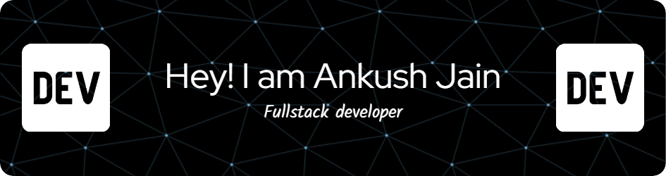

### Who am i?
- 🔭 I am currently working as a **Senior Software Engineer**.
- 🌱 Passionate about all things **Programming**, I am always eager to explore new technologies and methodologies.
- :seedling: Currently diving deep into **AI**, constantly seeking to broaden my knowledge and skillset.

### Technologies I'm Comfortable With
- **Backend:** Node.js, NestJs, ExpressJs, Loopback, PHP, Laravel, Codeigniter, Python, Django, Flask
- **Frontend:** ReactJS, AngularJs, Angular 2+
- **Mobile:** Ionic 5, React-Native
- **Databases:** MongoDB, Redis, MySQL, Firebase DB
- **Cloud Platforms:** GCP, AWS, Linux Server, Firebase
- **Tools and Services:** Docker, OpenLens, New Relic, Mailchimp, Stripe, RazorPay, Beacons, GitHub, Trello, Jira
- **Other:** JavaFX, Electron

### Fun Facts
- I like to work 12 hours sometimes; there's just so much to explore and create!
- I learn very quickly; adaptability is key in the fast-paced world of IT.
- I believe in the trial and error method for learning - it's where innovation thrives!
