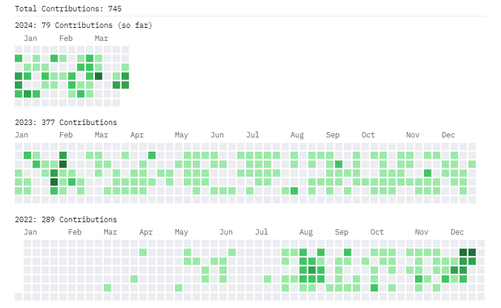

### Who am i?
- 🔭 Just your average **Senior Software Sorcerer** conjuring code spells in the depths of the digital realm.
- 🌱 In a torrid love affair with **Programming**, I flirt shamelessly with every new tech that catches my eye.
- :seedling: Currently lost in the mystical forests of **AI**, where I wrestle with neural networks and dance with data dragons.

### Technologies I'm Comfortable With
- **Backend:** Node.js, NestJs, ExpressJs, Loopback, PHP, Laravel, Codeigniter, Python, Django, Flask
- **Frontend:** ReactJS, AngularJs, Angular 2+
- **Mobile:** Ionic 5, React-Native
- **Databases:** MongoDB, Redis, MySQL, Firebase DB
- **Cloud Platforms:** GCP, AWS, Linux Server, Firebase
- **Tools and Services:** Docker, OpenLens, New Relic, Mixpanel, GitHub, Trello, Jira
- **Other:** JavaFX, Electron

### Fun Facts
- I learn faster than a speeding bullet; adapting is my superpower in the chaos of IT.
- I believe in the trial and error method for learning - it's like throwing spaghetti at the wall and seeing what sticks. Hey, innovation thrives in chaos, right?

